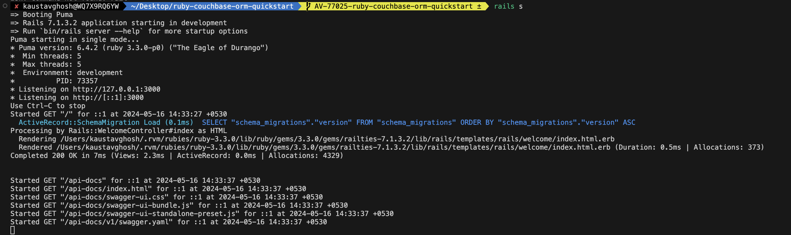
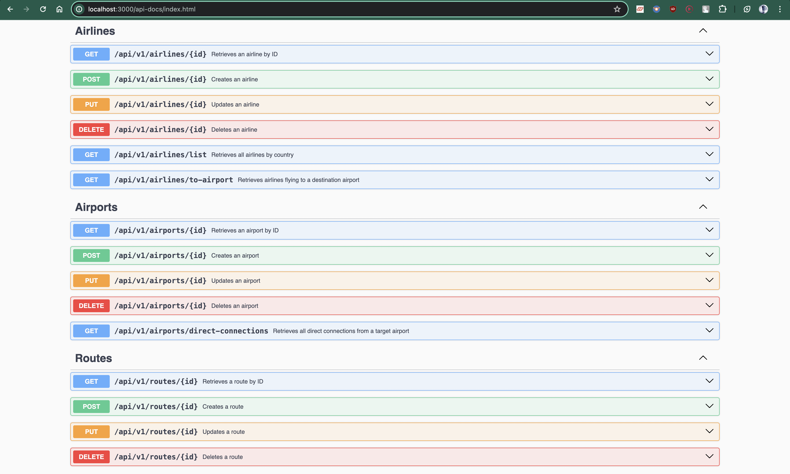

# Quickstart in Couchbase with Ruby Couchbase ORM

## Build a REST API with Ruby Couchbase ORM

Often, the first step developers take after creating their database is to create a REST API capable of performing Create, Read, Update, and Delete (CRUD) operations for that database. This repository is designed to teach you and provide you with a starter project (in Ruby on Rails) to generate such a REST API. Once you have installed the travel-sample bucket in your database, you can run this application, which is a REST API with Swagger documentation, to learn:

- How to create, read, update, and delete documents using Key-value operations (KV operations). Key-value operations are unique to Couchbase and provide super-fast (think microseconds) queries.
- How to write simple parameterized SQL++ queries using the built-in travel-sample bucket.

You can find the full documentation for the tutorial on the [Couchbase Developer Portal](https://www.couchbase.com/developers)

## Prerequisites

To run this prebuilt project, you will need:

- [Couchbase Capella cluster](https://www.couchbase.com/products/capella/) with [travel-sample bucket](https://docs.couchbase.com/ruby-sdk/current/ref/travel-app-data-model.html) loaded.
- To run this tutorial using a [self-managed Couchbase cluster](https://docs.couchbase.com/capella/current/getting-started/self-managed-cluster.html), please refer to the appendix.
- [Ruby 3.4.1](https://www.ruby-lang.org/en/documentation/installation/) is installed on the local machine.
- Basic knowledge of [Ruby](https://www.ruby-lang.org/en/documentation/), [Ruby on Rails](https://rubyonrails.org/), and [RSpec](https://rspec.info/).

## Loading Travel Sample Bucket

If travel-sample is not loaded in your Capella cluster, you can load it by following the instructions for your Capella Cluster:

- Load travel-sample bucket in Couchbase Capella

## App Setup

We will walk through the different steps required to get the application running.

### Cloning Repo

```sh
git clone https://github.com/couchbase-examples/ruby-couchbase-orm-quickstart.git
```

### Install Dependencies

Any dependencies will be installed by running the bundle install command, which installs any dependencies required for the project.

```sh
bundle install
```

### Setup Database Configuration

To learn more about connecting to your Capella cluster, please follow the instructions.

Specifically, you need to do the following:

#### For Development and Test Environments

Copy the `dev.env.example` file to `dev.env` and update the connection details:

```sh
cp dev.env.example dev.env
```

Edit `dev.env` with your Couchbase credentials:

```sh
DB_USERNAME="your_username"
DB_PASSWORD="your_password"
DB_CONN_STR="couchbases://your-cluster.cloud.couchbase.com"
```

The application will automatically load these environment variables in development and test environments.

#### Configuration File Reference

The `config/couchbase.yml` file defines how the application connects to Couchbase:

```yml
common: &common
  bucket: travel-sample
  connection_string: <%= ENV['DB_CONN_STR'] %>
  username: <%= ENV['DB_USERNAME'] %>
  password: <%= ENV['DB_PASSWORD'] %>

development:
  connection_string: couchbase://localhost
  username: Administrator
  password: password

test:
  <<: *common

production:
  <<: *common
```

> Note: The connection string expects the `couchbases://` or `couchbase://` part.

## Couchbase Index Management

This application requires specific N1QL indexes on the `travel-sample` bucket to function correctly. These indexes optimize the SQL++ queries used by the application for filtering and joining documents.

### Automatic Index Setup

Indexes are automatically created when you:

- Run `bin/setup` for local development setup
- Run tests in CI/CD (GitHub Actions automatically creates indexes before running tests)

The application uses idempotent index creation (using `CREATE INDEX IF NOT EXISTS`), so it's safe to run the setup multiple times.

### Required Indexes

The application requires the following indexes on the `travel-sample` bucket:

1. **`idx_type`** - General index on the `type` field for all document queries
2. **`idx_type_country`** - Index for airline queries filtered by country (`Airline.list_by_country_or_all`)
3. **`idx_type_destinationairport`** - Index for route queries by destination airport (`Airline.to_airport`)
4. **`idx_type_sourceairport_stops`** - Index for route queries by source airport and stops (`Route.direct_connections`)
5. **`idx_type_airlineid`** - Index for airline queries by airline ID (used in joins with routes)

### Manual Index Management

You can manually manage indexes using the following Rake tasks:

#### Create All Required Indexes

```sh
bundle exec rake couchbase:setup_indexes
```

This command creates all required indexes on the `travel-sample` bucket. It's idempotent and safe to run multiple times.

#### List All Indexes

```sh
bundle exec rake couchbase:list_indexes
```

This command lists all indexes currently present in the `travel-sample` bucket, including their state, type, and indexed fields.

#### Drop Application Indexes

```sh
bundle exec rake couchbase:drop_indexes
```

This command drops all application-managed indexes. It requires confirmation before executing. For automated scripts, you can force the operation:

```sh
FORCE_DROP=true bundle exec rake couchbase:drop_indexes
```

> **Warning**: Use with caution! Dropping indexes will cause queries to fail until indexes are recreated.

### Troubleshooting Index Issues

If you encounter index-related errors:

1. **Verify indexes exist**:
   ```sh
   bundle exec rake couchbase:list_indexes
   ```

2. **Check index state**: Indexes should be in "online" state. If they're "building" or "pending", wait for them to complete.

3. **Recreate indexes**:
   ```sh
   bundle exec rake couchbase:drop_indexes
   bundle exec rake couchbase:setup_indexes
   ```

4. **Check permissions**: Ensure your Couchbase user has "Query Manage Index" permission to create and drop indexes.

### Index Creation in CI/CD

The GitHub Actions workflow automatically creates indexes before running tests. If index creation fails in CI:

1. Check the "Setup Couchbase indexes" step in the GitHub Actions log
2. Verify that `DB_CONN_STR`, `DB_USERNAME`, and `DB_PASSWORD` secrets/variables are correctly set
3. Ensure the Couchbase user has "Query Manage Index" permission
4. Check that the Couchbase cluster is accessible from GitHub Actions runners

## Running The Application

### Directly on machine

At this point, we have installed the dependencies, loaded the travel-sample data and configured the application with the credentials. The application is now ready and you can run it.

The application will run on a port specified by Rails. You can find the port in the terminal after running the application. You will find the Swagger documentation at [http://localhost:3000/api-docs](http://localhost:3000/api-docs) of the API if you go to the URL in your browser.

```sh
rails server
```

### Using Docker

- Build the Docker image

```sh
docker build -t ruby-couchbase-orm-quickstart .
```

- Run the Docker image

```sh
docker run -p 3000:3000 ruby-couchbase-orm-quickstart -e DB_CONN_STR=<connection_string> -e DB_USERNAME=<user_with_read_write_permission_to_travel-sample_bucket> -e DB_PASSWORD=<password_for_user>
```

## Verifying the Application

Once the application starts, you can see the details of the application on the terminal.



The application will run on the port specified by Rails on your local machine (eg: http://localhost:3000). You will find the interactive Swagger documentation of the API if you go to the URL in your browser. Swagger documentation is used in this demo to showcase the different API endpoints and how they can be invoked. More details on the Swagger documentation can be found in the appendix.



## Running The Tests

The application includes two types of tests:

### Integration Tests

Integration tests verify the actual functionality of the API endpoints. They test the full request-response cycle including database operations.

```sh
bundle exec rspec spec/requests/api/v1
```

### Swagger Documentation Tests

These tests generate the OpenAPI/Swagger documentation and verify the API contract without performing full integration testing.

```sh
bundle exec rake rswag:specs:swaggerize
```

## Health Check Endpoint

The application provides a health check endpoint to monitor the status of the service and its dependencies:

```sh
GET /api/v1/health
```

This endpoint returns the health status of the application and its connection to Couchbase. Example response:

```json
{
  "status": "healthy",
  "timestamp": "2025-12-02T10:30:00Z",
  "services": {
    "couchbase": {
      "status": "up",
      "message": "Connected to Couchbase bucket: travel-sample"
    }
  }
}
```

You can use this endpoint for monitoring and alerting in production environments.

## Troubleshooting

### Couchbase ORM Connection Issues

If you encounter connection issues with Couchbase ORM, verify the following:

1. **Check configuration**: Ensure `config/couchbase.yml` has the correct connection string, username, and password.
2. **Connection string format**: The connection string should start with `couchbase://` (for non-TLS) or `couchbases://` (for TLS).
3. **Bucket access**: Verify that the user has read/write permissions to the travel-sample bucket.
4. **Network connectivity**: Ensure your application can reach the Couchbase cluster on the required ports (typically 8091-8096, 11210).

### Common couchbase-orm Errors

**Error: `Couchbase::Error::BucketNotFound`**
- The specified bucket doesn't exist or isn't accessible
- Solution: Verify the bucket name in `config/couchbase.yml` and ensure the travel-sample bucket is loaded

**Error: `Couchbase::Error::AuthenticationFailure`**
- Invalid credentials
- Solution: Check username and password in `config/couchbase.yml` or environment variables

**Error: `Couchbase::Error::Timeout`**
- Network connectivity issues or cluster overload
- Solution: Check network connectivity, increase timeout in connection options, or verify cluster health

**Error: `NoMethodError: undefined method 'bucket' for Model`**
- ORM not properly initialized
- Solution: Ensure `config/couchbase.yml` is correctly configured and the Rails application has loaded the configuration

### Test Setup Issues

**Tests failing with connection errors:**
- Ensure environment variables `DB_CONN_STR`, `DB_USERNAME`, and `DB_PASSWORD` are set for the test environment
- Verify the travel-sample bucket is loaded and accessible
- Check that the test configuration in `config/couchbase.yml` references these environment variables

**Swagger generation fails:**
- Run `bundle exec rake rswag:specs:swaggerize` with proper environment variables
- Check that all swagger specs in `spec/requests/swagger/` are valid

### CI/CD Configuration

When setting up GitHub Actions or other CI/CD pipelines:

1. Set required secrets/variables:
   - `DB_CONN_STR`: Connection string to your Couchbase cluster
   - `DB_USERNAME`: Username with bucket access
   - `DB_PASSWORD`: Password (set as a secret, not a variable)

2. Ensure the CI environment can access your Couchbase cluster (check firewall rules and allowed IP addresses)

3. The CI workflow runs:
   - Configuration validation
   - Integration tests: `bundle exec rspec spec/requests/api/v1`
   - Swagger generation: `bundle exec rake rswag:specs:swaggerize`

# Appendix

## Data Model

For this quickstart, we use three collections, airport, airline and routes that contain sample airports, airlines and airline routes respectively. The route collection connects the airports and airlines as seen in the figure below. We use these connections in the quickstart to generate airports that are directly connected and airlines connecting to a destination airport. Note that these are just examples to highlight how you can use SQL++ queries to join the collections.


## Extending API by Adding a New Entity

If you would like to add another entity to the APIs, follow these steps:

1. Create a new model:
   - Create a new model file for the entity in the `app/models` folder.
   - Define the schema for the entity using the appropriate attributes and validations.
   - Example: `app/models/customer.rb`

2. Create the new routes:
   - Open the `config/routes.rb` file.
   - Add new routes for the entity's CRUD operations using the `resources` method.
   - Example:
     ```ruby
     namespace :api do
       namespace :v1 do
         resources :customers
       end
     end
     ```

3. Create the new controller:
   - Create a new controller file for the entity in the `app/controllers/api/v1` folder.
   - Implement the necessary CRUD actions (index, show, create, update, destroy) in the controller.
   - Example: `app/controllers/api/v1/customers_controller.rb`

4. Add Swagger documentation (for API documentation only):
   - Create a new swagger spec file in `spec/requests/swagger/customers_spec.rb`.
   - Define the Swagger documentation for the new entity's API endpoints using RSpec and the `rswag` gem.
   - These specs should be documentation-only (no actual database operations).
   - Example:
     ```ruby
     require 'swagger_helper'

     # Documentation-only specs for Swagger/OpenAPI generation
     # Actual integration testing done in spec/requests/api/v1/customers_spec.rb
     describe 'Customers API', type: :request do
       path '/api/v1/customers/{id}' do
         get 'Retrieves a customer' do
           tags 'Customers'
           produces 'application/json'
           parameter name: :id, in: :path, type: :string

           response '200', 'customer found' do
             schema type: :object,
                    properties: {
                      name: { type: :string },
                      email: { type: :string }
                    },
                    required: ['name', 'email']

             let(:id) { 'customer_123' }
             run_test! do |response|
               # Documentation-only - actual testing in spec/requests/api/v1/customers_spec.rb
             end
           end
         end
       end
     end
     ```

5. Add integration tests (for actual functionality testing):
   - Create a new integration test file for the entity in the `spec/requests/api/v1/` folder.
   - Write comprehensive integration tests to verify CRUD operations work correctly.
   - Example: `spec/requests/api/v1/customers_spec.rb`
     ```ruby
     require 'rails_helper'

     RSpec.describe 'Customers API', type: :request do
       describe 'GET /api/v1/customers/{id}' do
         it 'returns the customer' do
           get '/api/v1/customers/customer_123'
           expect(response).to have_http_status(:ok)
           # Add more assertions
         end
       end

       describe 'POST /api/v1/customers/{id}' do
         it 'creates a customer' do
           post '/api/v1/customers/customer_new', params: { customer: { name: 'Test', email: 'test@example.com' } }
           expect(response).to have_http_status(:created)
           # Clean up
           delete '/api/v1/customers/customer_new'
         end
       end

       # Add more tests for other CRUD operations
     end
     ```

6. Run tests and verify:
   - Run the integration tests: `bundle exec rspec spec/requests/api/v1/customers_spec.rb`
   - Generate swagger documentation: `bundle exec rake rswag:specs:swaggerize`
   - Ensure that all tests pass and the new entity's CRUD operations work correctly.

By following these steps, you can systematically extend the API functionality with a new entity while maintaining a well-structured and tested codebase.

## Running Self-Managed Couchbase Cluster

If you are running this quickstart with a self-managed Couchbase cluster, you need to load the travel-sample data bucket in your cluster and generate the credentials for the bucket by creating a user.

You need to update the connection string and the credentials in the `couchbase.yml` file in the `config` folder.

Note: Couchbase Server must be installed and running before running this app.

## Swagger Documentation

Swagger documentation provides a clear view of the API including endpoints, HTTP methods, request parameters, and response objects.

Click on an individual endpoint to expand it and see detailed information. This includes the endpoint's description, possible response status codes, and the request parameters it accepts.

### Trying Out the API

You can try out an API by clicking on the "Try it out" button next to the endpoints.

Parameters: If an endpoint requires parameters, Swagger UI provides input boxes for you to fill in. This could include path parameters, query strings, headers, or the body of a POST/PUT request.

Execution: Once you've inputted all the necessary parameters, you can click the "Execute" button to make a live API call. Swagger UI will send the request to the API and display the response directly in the documentation. This includes the response code, response headers, and response body.

### Models

Swagger documents the structure of request and response bodies using models. These models define the expected data structure using JSON schema and are extremely helpful in understanding what data to send and expect.
